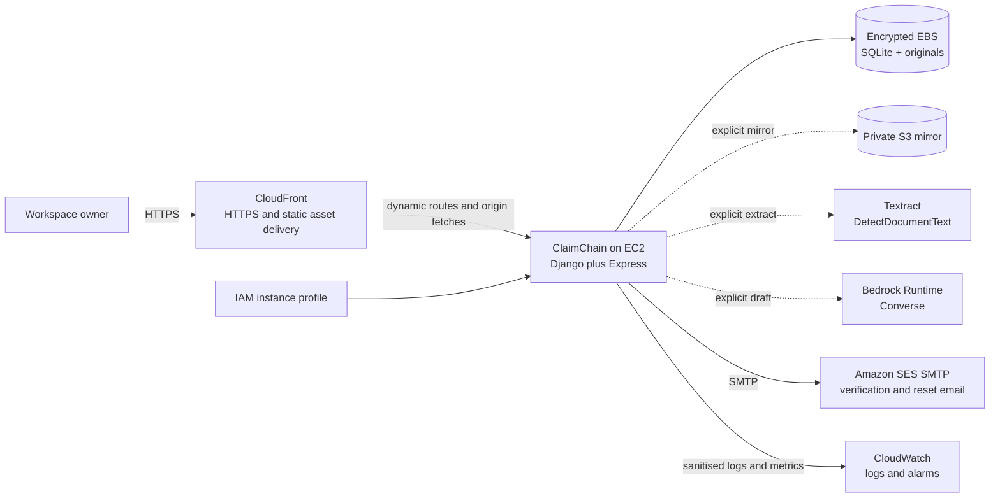

# ClaimChain AWS Deployment Architecture

## Purpose and status

This chapter explains how AWS services fit ClaimChain and how to deploy the current single-instance application for a controlled competition demonstration.

**Current truth:** the application is deployed and reachable at
**https://d29p3muqc49obl.cloudfront.net**, running in `ap-southeast-2`. The
services below were each exercised against the live instance rather than
assumed working. “Proposed production” sections still describe evolution, not
shipped infrastructure.

### Deployed configuration

| Component | Value |
| --- | --- |
| Public URL | `https://d29p3muqc49obl.cloudfront.net` |
| Region | `ap-southeast-2` |
| Compute | One EC2 `t3.micro`, Docker, both services from `scripts/start.mjs` |
| Storage | Encrypted EBS volume mounted at `/app/data` |
| Instance role | `claimchain-ec2`, inline policy `claimchain-access` |
| Evidence bucket | `claim-chain-aws-first-com` |
| Bedrock model | `amazon.nova-lite-v1:0` |
| Origin exposure | Port 80 only; CloudFront terminates TLS |

### Verification performed against the live instance

- **IAM** — `aws sts get-caller-identity` returned
  `assumed-role/claimchain-ec2`, confirming the instance profile resolves.
- **Amazon S3** — `aws s3 cp` to the evidence bucket succeeded. `aws s3 ls` was
  correctly denied: the policy grants `PutObject` and `GetObject` only, and the
  application never lists buckets.
- **Amazon Textract** — a `DetectDocumentText` call returned
  `UnsupportedDocumentException` for a deliberately invalid payload, proving the
  request authenticated and reached the service.
- **Amazon Bedrock** — a `Converse` call returned a completion, and a second
  call with a system block confirmed system prompts are honoured, which is the
  exact shape `draftWithBedrock` sends.
- **Application health** — `/api/health` and `/auth/health` both return `ok`
  through CloudFront, confirming the Express and Django processes and the CDN
  path.

### Known gaps in the deployed demonstration

- **Amazon SES** is implemented in `server/mailer.ts` and requires only SMTP
  credentials in the environment. Confirm whether the running deployment has
  them set; without them, `sendAuthCode` falls back to console logging.
- **Django** runs under `manage.py runserver`, a development server. Replace it
  with gunicorn before any non-demonstration use.
- **No automated backup.** EBS snapshots are manual.
- **Bedrock model choice was constrained by region.** No Anthropic model was
  offered in `ap-southeast-2`, and the OpenAI models there are served through
  AWS Marketplace, which this account's Service Control Policies prevented
  subscribing to. Amazon Nova is native to Bedrock and worked on the first
  call. Because the Converse API is model-agnostic, this was a one-variable
  change with no code modification.

## AWS service map

| AWS service | Status in this project | Responsibility |
| --- | --- | --- |
| Amazon EC2 | Selected deployment service | Runs the Dockerised Django identity service and Express workspace service on one host. |
| Amazon EBS | Selected deployment service | Provides the encrypted persistent data volume for SQLite databases and original evidence. |
| Amazon S3 | Optional application integration | Receives an explicit private evidence mirror with SHA-256 metadata. |
| Amazon Textract | Optional application integration | Extracts printed text from supported PNG/JPEG evidence up to 5 MiB. |
| Amazon Bedrock | Optional application integration | Creates a factual, review-required recovery-letter draft through Converse. |
| Amazon SES | Selected email delivery service | Delivers verification and password-reset messages through its SMTP endpoint. |
| Amazon CloudFront | Selected edge delivery service | Serves static application assets over HTTPS and forwards dynamic requests to the EC2 origin. |
| AWS Identity and Access Management (IAM) | Required deployment control | Gives the EC2 instance only the S3, Textract, and Bedrock permissions it needs. |
| Amazon CloudWatch | Selected operations service | Monitors host health, disk capacity, application logs, error rates, and alarms. |

Systems Manager, AWS Backup or scheduled EBS snapshots, Route 53, and ECR are sensible supporting services but are not required to understand or run the selected architecture. CloudFront must not cache authenticated or API responses. WAF, ALB, ECS/Fargate, RDS, Cognito, SQS, Step Functions, and EventBridge are future scale options, not part of the current deployment.

## Current AWS integration flow



The server uses the default AWS SDK credential provider chain. On EC2, use an attached instance profile. Never bake long-lived keys into the image, commit them, or expose them through Vite variables.

## Selected platform services in detail

### Amazon EC2 and Amazon EBS

EC2 is the single compute host for the current architecture. Docker starts the Django authentication service, the Express workspace API, and the production browser application from the same release artifact. This deliberately keeps the competition deployment small and understandable.

EBS is the durable local data layer. The Docker data volume must be placed on an encrypted EBS volume so the operational SQLite database, Django identity database, and `evidence/` originals survive container replacement and routine host restarts. The application is a single-instance design: do not run two writable copies against the same workspace data.

### Amazon CloudFront

CloudFront is the public edge in front of the EC2 origin. It provides HTTPS delivery and efficient caching for versioned JavaScript, CSS, fonts, and image assets. Authentication and operational data are dynamic and sensitive, so `/auth/*` and `/api/*` must be configured as non-cached behaviours that forward the required cookies and request headers to the origin.

### Amazon SES

SES is the selected production mail provider for account verification and password recovery. Django sends these messages through SES SMTP using the standard SMTP configuration in `.env`; no password-reset code is returned to a production browser response. SES sender verification, sandbox exit where applicable, and bounce/complaint handling are account-level deployment tasks that must be complete before inviting real users.

### IAM and CloudWatch

The EC2 instance receives an IAM role rather than permanent AWS access keys. The role permits only the configured S3 write prefix, Textract text detection, and the selected Bedrock model or inference profile. SES SMTP credentials are separate mail credentials and must be stored as secrets, never source code.

CloudWatch is the operating view of the deployed service. It should collect EC2 and disk health, reverse-proxy and application logs, service restarts, API health failures, AWS integration errors, and alarm thresholds. Logs must remain sanitised: never send evidence content, browser cookies, passwords, reset codes, or complete model prompts.

## Implemented services

### Amazon S3: evidence mirror

`POST /api/evidence/:id/mirror` reads local original bytes and calls `PutObject` with:

- bucket from `S3_BUCKET`;
- key `evidence/<case-id>/<evidence-id>`;
- original content type;
- SSE-S3 (`AES256`);
- `sha256` object metadata.

Only a successful `PutObject` adds `cloudKey` and an “Evidence mirrored” event. Keep Block Public Access enabled, disallow public ACLs, enable versioning, and align lifecycle/retention with the evidence policy.

This is a mirror. Local evidence remains the download source and must still be backed up. Making S3 primary requires object retrieval authorization, retention/deletion behavior, and migration of existing files.

### Amazon Textract: evidence extraction

`POST /api/evidence/:id/extract` calls synchronous `DetectDocumentText` with in-memory bytes. The release accepts PNG/JPEG evidence up to 5 MiB and joins returned `LINE` blocks into reviewable text.

PDF/TIFF and multipage processing are not implemented. A future asynchronous flow would use S3, `StartDocumentTextDetection`, SNS/SQS or a worker for completion, and `GetDocumentTextDetection` for results.

### Amazon Bedrock: assisted drafting

With `BEDROCK_MODEL_ID` configured, document creation with `ai=true` calls Bedrock Runtime `Converse`. The model receives reviewed case fields, deterministic outstanding balance text, workspace identity, and filenames plus up to 8,000 characters of extracted text per evidence item.

The system instruction treats evidence as untrusted data, prohibits invented facts/legal provisions/threats/signatures/delivery claims, requests INR, and requires owner review. Inference uses temperature `0.2` and a 1,200-token ceiling.

The output is stored as an editable, unsent draft with provider `Amazon Bedrock - review required`. Model compatibility and availability vary by account and Region; use a Converse-compatible model or inference profile the role can invoke.

## Recommended competition deployment

The SQLite/filesystem design requires one application instance. Use EC2 with an encrypted EBS-backed data volume.

### 1. Prepare the account

- Choose one Region supporting the intended Textract and Bedrock operations. The default is `ap-south-1`.
- Confirm the selected Bedrock target supports Converse and is accessible.
- Create a private S3 bucket in the same Region with Block Public Access, encryption, and versioning.
- Create an EC2 role with only the permissions below.
- Ensure the application data volume and snapshots are encrypted.

### 2. Launch the host

- Use a supported AWS Linux AMI with enough memory for Node, Django, uploads, PDF generation, and Docker builds.
- Attach the IAM role.
- Prefer administration through Systems Manager and avoid public SSH.
- Restrict inbound access to the HTTPS reverse proxy; never expose application port `3001` or Django port `8000` publicly.

### 3. Configure the application

Create `.env` from `.env.example`:

```dotenv
HOST=0.0.0.0
PORT=3001
DATA_DIR=/app/data
SEED_SAMPLE=false

AUTH_BOOTSTRAP_USERNAME=admin
AUTH_BOOTSTRAP_EMAIL=admin@claims.example.com
AUTH_BOOTSTRAP_PASSWORD=<unique strong bootstrap password>
AUTH_COOKIE_SECURE=true
AUTH_EXPOSE_CODES=false
APP_ORIGIN=https://claims.example.com

SMTP_HOST=email-smtp.ap-south-1.amazonaws.com
SMTP_PORT=587
SMTP_SECURE=false
SMTP_USER=<SES SMTP username>
SMTP_PASSWORD=<SES SMTP password>
SMTP_FROM=ClaimChain <noreply@claims.example.com>

SIMULATION_ENABLED=false

AWS_REGION=ap-south-1
S3_BUCKET=<private bucket name>
ENABLE_TEXTRACT=true
BEDROCK_MODEL_ID=<Converse-compatible model or inference-profile ID>
```

Store production secret values in Systems Manager Parameter Store or Secrets Manager and materialize them at runtime. Do not commit the populated file.

### 4. Build and start

```sh
docker compose up -d --build
docker compose ps
curl http://127.0.0.1:3001/api/health
```

Compose binds the service to host loopback and stores `/app/data` in a named volume. Verify that Docker persists the volume on the intended EBS filesystem.

### 5. Add CloudFront and HTTPS

Put a maintained reverse proxy in front of the local application services. The reverse proxy routes `/auth` to Django on port `8000`, routes `/api` to Express on port `3001`, and serves the production browser application. Configure CloudFront with this HTTPS origin. Cache versioned static assets, but forward cookies and disable caching for `/auth/*` and `/api/*`. Route 53 can provide DNS. Do not add another application replica while SQLite is authoritative.

Required properties:

- HTTPS only, with HTTP redirected;
- `APP_ORIGIN` exactly matches the public origin;
- `COOKIE_SECURE=true`;
- proxy preserves host/forwarding headers;
- application ports stay private;
- CloudFront does not cache authenticated or API responses.

### 6. Configure SES delivery

Verify an SES sender identity or domain, complete sandbox exit when required, and create SMTP credentials with permission to send from the approved identity. Configure `SMTP_HOST`, `SMTP_PORT`, `SMTP_USER`, `SMTP_PASSWORD`, and `SMTP_FROM` as shown above. The current Django service uses standard SMTP via Django's mail backend; it does not expose AWS credentials to the browser.

Before accepting real users, send and receive verification and reset messages using a controlled test account. Configure bounce and complaint handling according to the organisation's email policy.

### 7. Verify the deployment

1. Sign in and create a disposable case.
2. Upload a non-sensitive test PNG/JPEG.
3. Run Textract and confirm provider metadata plus an event.
4. Mirror to S3 and verify the private object and `sha256` metadata.
5. Generate a Bedrock draft and verify its review label.
6. Export and inspect the packet.
7. Restart the container and host; verify records and original bytes persist.
8. Record Region, AMI, instance type, image digest, model target, bucket, test time, and operator.

## Least-privilege IAM shape

Replace placeholders and keep only the Bedrock resource forms needed by the configured target.

```json
{
  "Version": "2012-10-17",
  "Statement": [
    {
      "Sid": "WriteClaimChainEvidence",
      "Effect": "Allow",
      "Action": ["s3:PutObject"],
      "Resource": "arn:aws:s3:::YOUR_BUCKET/evidence/*"
    },
    {
      "Sid": "ExtractEvidenceText",
      "Effect": "Allow",
      "Action": ["textract:DetectDocumentText"],
      "Resource": "*"
    },
    {
      "Sid": "DraftRecoveryLetters",
      "Effect": "Allow",
      "Action": ["bedrock:InvokeModel"],
      "Resource": [
        "arn:aws:bedrock:REGION::foundation-model/MODEL_ID",
        "arn:aws:bedrock:REGION:ACCOUNT_ID:inference-profile/PROFILE_ID"
      ]
    }
  ]
}
```

Cross-Region inference profiles can require permission for destination model resources. Confirm the exact policy with the selected model/profile documentation.

## Failure behavior

SDK clients use `maxAttempts: 2`. S3/Textract calls have a 30-second abort timeout; Bedrock has 45 seconds. Calls run in the request path.

If a cloud request fails:

- local evidence remains available;
- no cloud provider/key/success event is recorded;
- financial and stock state is untouched;
- the user receives an error rather than a false success.

At larger scale, move OCR and drafting behind durable jobs with idempotency, retries, dead-letter queues, and explicit job status.

## Backup and restore

Treat SQLite and `evidence/` as one unit:

1. Stop the container during a maintenance window.
2. Snapshot the complete EBS-backed data volume or copy the complete Docker volume.
3. Restart and verify health.
4. Periodically restore into a separate instance.
5. Verify database open, evidence download, PDF export, and one financial/inventory workflow.

Do not copy only the live `claimchain.sqlite` while WAL writes may be active. S3 mirrors are not a complete workspace backup.

Suggested demo targets, not guarantees: daily-snapshot RPO with an extra pre-demo snapshot, and one-to-four-hour RTO depending on automation.

## Monitoring checklist

Recommended CloudWatch coverage:

- EC2 status check, CPU, memory, and disk;
- container restarts and `/api/health` failures;
- reverse-proxy 4xx/5xx rate and latency;
- EBS capacity/burst metrics where relevant;
- S3/Textract/Bedrock errors and latency from sanitized structured logs;
- billing alarms and service quota review.

Never log uploaded contents, session tokens, passwords, or full model prompts.

## Proposed production evolution

To become a public multi-tenant service:

1. Replace the snapshot repository with tenant-scoped PostgreSQL on RDS.
2. Make S3 the primary evidence store with per-tenant prefixes, KMS, scanning, retention, and deletion.
3. Run stateless API replicas on ECS/Fargate behind an ALB.
4. Use Cognito or another identity provider and enforce tenant authorization per record.
5. Move OCR/drafting/reminders into SQS/EventBridge/Step Functions workers.
6. Add SES only with sender verification, consent, receipts, and bounce/complaint handling.
7. Add CloudFront/WAF, centralized secrets, CloudTrail review, migrations, alarms, and tested disaster recovery.

This is a new architecture, not a scaling toggle.

## Official AWS references

- [Amazon S3 `PutObject`](https://docs.aws.amazon.com/AmazonS3/latest/API/API_PutObject.html)
- [Amazon Textract `DetectDocumentText`](https://docs.aws.amazon.com/textract/latest/dg/API_DetectDocumentText.html)
- [Textract document byte/S3 limits](https://docs.aws.amazon.com/textract/latest/dg/API_Document.html)
- [Textract asynchronous operations](https://docs.aws.amazon.com/textract/latest/dg/api-async.html)
- [Amazon Bedrock Converse API](https://docs.aws.amazon.com/bedrock/latest/APIReference/API_runtime_Converse.html)
- [Bedrock model/API compatibility](https://docs.aws.amazon.com/bedrock/latest/userguide/models-api-compatibility.html)
- [Bedrock inference permissions](https://docs.aws.amazon.com/bedrock/latest/userguide/inference.html)
